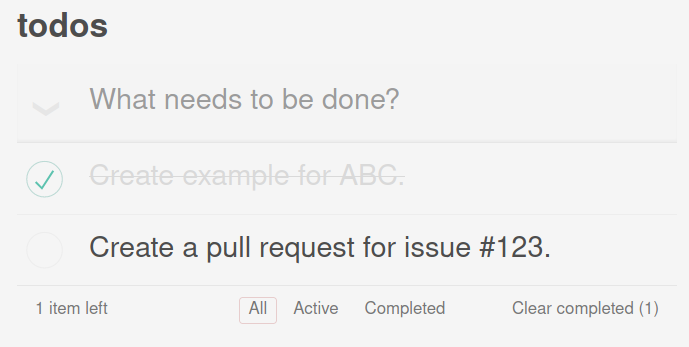

Trunk | Seed
============

An example application demonstrating building a WASM web application using Trunk & Seed taken from: [Seed TodoMVC Example](https://github.com/seed-rs/seed/tree/master/examples/todomvc)

Once you've installed Trunk, simply execute `trunk serve --open` from this example's directory, and you should see the web application rendered in your browser.

