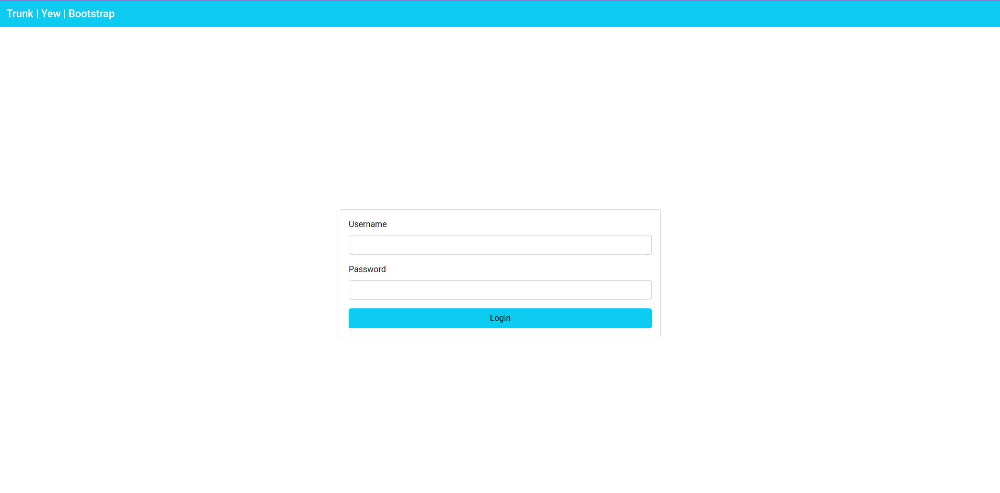

Trunk | Yew | Bootstrap 5
======================
An example application demonstrating building a WASM web application using Trunk, Yew & Bootstrap.

This example also covers building reusable code (function) using props

Simply execute `trunk serve --open` from this example's directory, and you should see the following web application rendered in your browser.

