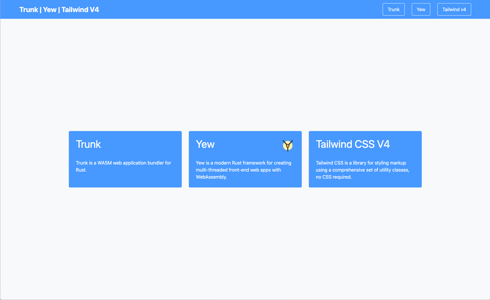

Trunk | Yew | Tailwind V4
======================
An example application demonstrating building a WASM web application using Trunk, Yew & Tailwind v4.

In order to run, this example requires a working nodejs installation that includes `npx`.

Simply execute `trunk serve --open` from this example's directory, and you should see the following web application rendered in your browser.

Notice the `tailwindcss = "4.1.3"` under the "[tools]" section in the `Trunk.toml` file.

