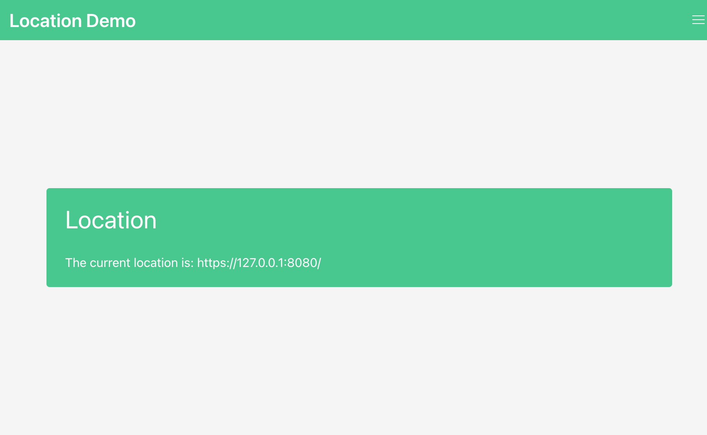

# Trunk | Yew | TLS

An example application demonstrating building a WASM web application using Trunk, Yew & YBC serving with TLS enabled.

Once you've installed Trunk, simply execute `trunk-ng serve --open` from this example's directory, and you
should see the following web application rendered in your browser. The application will be served using
the self-signed TLS certificates located in `self_signed_certificates` and configured in `Trunk.toml`.



## Creating new self-signed certificates

> [!CAUTION]
> Using self-signed certificates can be fine for a local, development scenario. Using them in any other scenario may be
> dangerous.

There are many ways to create self-signed certificates, here is one of them:

```shell
openssl req -new -newkey rsa:4096 -days 3650 -nodes -x509 \
    -subj "/C=XX/CN=localhost" \
    -keyout self_signed_certs/key.pem  -out self_signed_certs/cert.pem
```
